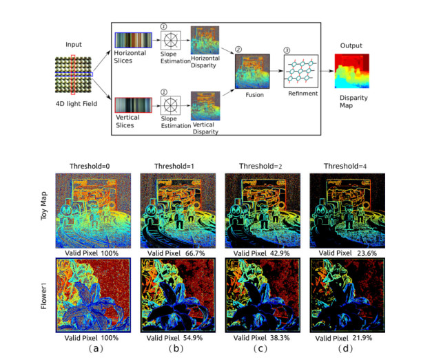
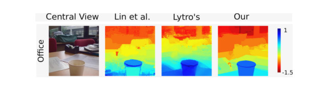

# Light-Field-Depth

This project contains implementations paper titled "A Simple Framework for Extracting Accurate Depth Map from Lenslet-based Light-Field Cameras"



Recently, extracting depth from light field has emerged as a new depth-sensing approach, and it is of great interest in
the computational imaging research field. Portable lenslet-based light-field cameras such as *Lytro* and *Raytrix*, enable us to perceive the depth of a scene with a single-lens sensor system in a snapshot. We present our simple and intuitive framework for depth from light field. In the above figure, it shows does our proposed system work. A threshold is used for picking reliable points which will be used for propagation based on Markov Random Field. One example is shown in the following figure.


If you use this code/model for your research, please cite the following paper:
```
@inproceedings{lightfield2depth2018,
    author = { Shan Xu and Nicholas Devaney},
    title  = {A Simple Framework for Extracting Accurate Depth Map from Lenslet-based Light-Field Cameras},
    booktitle = {Under Review,
    year   = {2018}
}
```

Dataset can be obtained from this  [link.](https://www.dropbox.com/sh/pt73w48puje5vwf/AABK3BEC0pH-I1RWU2A0yyYna?dl=0)
### Building on Ubuntu
The code depends OpenCV library (Version>3.0) and HDF5.
Use qmake to generate the makefile
```
./qmake
```
Compile the code
```
make -j4
```
